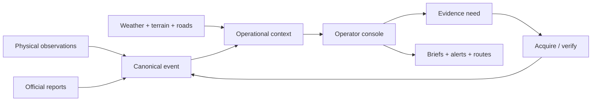
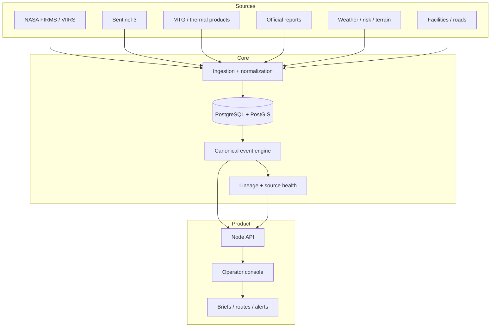

# VIGIA

**Portugal-first crisis intelligence for turning fragmented wildfire signals into attributable, inspectable operational context.**

VIGIA is a full-stack decision-support system built around one rule: **an operational interface should distinguish what was observed, what was reported, what was inferred, and what is still unknown.**

> Live portfolio demo: https://vigia-portfolio-demo.onrender.com

## The product in 30 seconds



VIGIA is not a generic dashboard. It is designed around an operator’s sequence of questions:

1. **What is happening?**
2. **Which source says that?**
3. **How fresh is it?**
4. **What is independently corroborated?**
5. **What is still missing?**
6. **What can I safely act on now?**

## Operator flow

```text
DETECT
Physical thermal point / official report / field observation
   ↓
ATTRIBUTE
source · timestamp · geometry · provenance
   ↓
ASSOCIATE
link observations to a stable incident identity
   ↓
UNDERSTAND
weather · facilities · roads · dependencies · history
   ↓
FIND THE GAP
missing observation / stale source / unresolved route / unknown capability
   ↓
ACT
brief · route · alert · acknowledgement · further acquisition
```

## Why I built it

Emergency interfaces often make two mistakes at once: they show too much data and they flatten confidence into a single visual layer.

VIGIA treats **source identity, freshness, spatial integrity, and uncertainty as product concepts**. A satellite point is not a fire perimeter. A public report is not physical measurement. An inferred relationship is not an observation. The UI and domain model preserve those differences.

## System architecture



## Engineering highlights

### Stable incident identity

Observations and reports can arrive in different orders. VIGIA associates them to persistent events instead of letting whichever source arrived last replace the incident identity.

### PostGIS as an operational primitive

Spatial relationships are queryable domain state, not just map decoration. The backend uses PostgreSQL/PostGIS for canonical observations, event associations, source checkpoints, lineage, and spatial reasoning.

### Geospatial integrity gates

Catalogue metadata is not sufficient to prove that a raster really covers the requested location. The scientific path validates CRS, transforms, pixel coordinates, and source-band alignment before image-derived screening is allowed to advance.

### Fail-closed source semantics

Source outages and stale data remain visible. VIGIA does not silently replace unavailable physical evidence with a different class of data.

### Readable uncertainty

The system distinguishes:

- physical observation;
- official report;
- association;
- screening/inference;
- unmeasured probability;
- missing evidence;
- stale/unavailable source.

That distinction is carried from backend contracts into the operator UI.

## Product surfaces

### Intelligence

Understand incidents, evidence families, source freshness, facilities, dependencies, historical context, and unresolved questions.

### Operations

Move from understanding to action: routes, restrictions, reception locations, facilities, alerts, and evidence-acquisition work.

### Reports & analysis

Retain situation history, compare prior states, and produce attributable briefs without erasing uncertainty.

## API surface

Representative endpoints include:

```text
GET  /api/v10/events
GET  /api/v10/evidence-needs
GET  /api/v10/capabilities
GET  /api/v10/ready
GET  /api/v10/prevention/findings
POST /api/v10/sensors/observations
POST /api/v10/sensors/:id/task
GET  /api/v10/alerts
POST /api/v10/alerts/:id/acknowledge
POST /api/v10/observations/change-screening
POST /api/v10/events/corrections/merge
POST /api/v10/events/corrections/split
POST /api/v10/events/corrections/reject
```

## Run locally

```bash
git clone https://github.com/miguelalmeida0/vigia-crisis.git
cd vigia-crisis
npm install
npm run runtime:setup
npm run geo:doctor
npm run dev:live
```

A real FIRMS key and PostGIS unlock the complete physical-observation path. Read-only inspection can run without them, but the system deliberately keeps readiness degraded rather than pretending the missing sources are available.

## Verification

```bash
npm run geo:doctor
npm test
npm run check
npm run smoke
```

Additional browser, PostGIS, replay, and operator-certification gates live in the repository.

## Safety and scope

VIGIA is a **portfolio/research decision-support system**, not operational certification for emergency command. It does not autonomously issue evacuation or dispatch decisions. Unvalidated screens abstain from probability claims, and physical measurements remain distinct from reports and derived context.

---

Built by [Miguel Almeida](https://github.com/miguelalmeida0).
